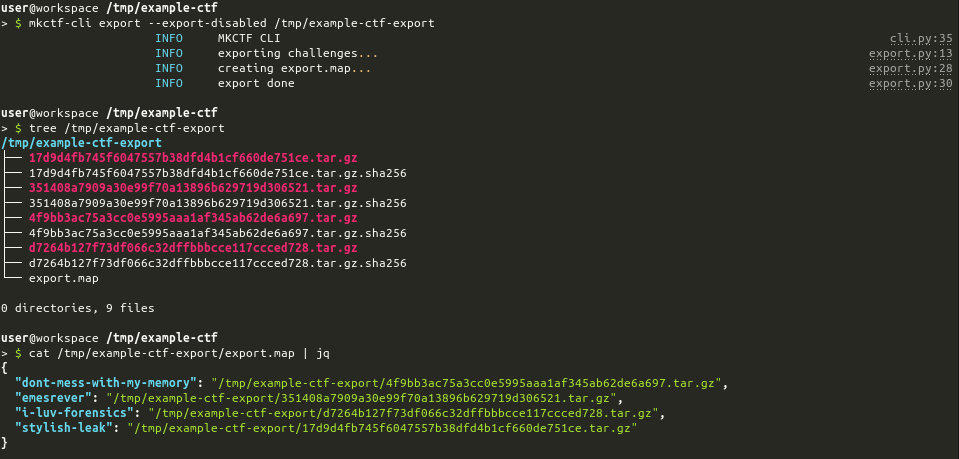
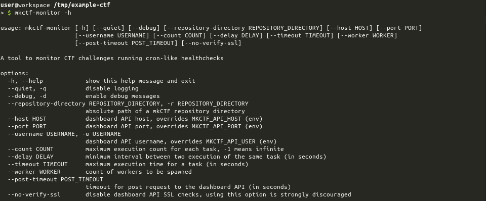

# mkCTF

## Why ?

This framework aims at helping your team create CTF challenges following a format which will enable efficient
integration and deployment on the CTF infrastructure.

This project was, initially, created for managing challenges for INS'hAck 2017 event.

You can find challenges and writeups of the past editions of INS'hAck in
[this repository](https://github.com/InsecurityAsso).

This project is evolving constantly to enable even more automation when deploying challenges on a
Rancher-based infrastructure.

## Early Warning

_Your mkCTF repository should remain **private** until the CTF ends because it stores flags in plaintext to allow user
to rebuild the challenge from sources reusing the same flag!_

## Requirements

This project has been design to run in a Linux environment having Python 3.6+ support.

It might work on Mac as well though I'm not using it on this platform.

I won't invest time in making it work on Windows as WSL2 will enable having a Linux environment running on your PC with
almost no effort.

## Installing and Creating a new CTF

mkCTF should be installed (and upgraded) using `setup.sh`. This script performs the following operations:

```bash
# clone mkctf repository in tmp directory
$ git clone https://github.com/koromodako/mkctf /tmp/mkctf
# create ~/bin dir if required and enter ~/bin
$ mkdir -p ~/bin && cd ~/bin
# create a Python 3 virtual environment
$ python3 -m venv .mkctf-venv
# install mkctf in the venv
$ .mkctf-venv/bin/pip install -U /tmp/mkctf
# create symbolic links for mkctf scripts
$ ln -sf ./mkctf-venv/bin/mkctf-* .
# leave ~/bin
cd ..
# ensure that config directory exists and copy configuration files in it
# note: you might want to review and customize the content of ~/.config/mkctf after its creation
$ mkdir -p ~/.config/mkctf && cp -r /tmp/mkctf/config/* ~/.config/mkctf/
# ensure that ~/bin is part of your path and try invoking mkctf-cli
$ mkctf-cli -h
```

Then lets say you want to create a CTF for INS'hAck 2020:

```bash
# create and enter inshack-2020/
$ mkdir inshack-2020 && cd inshack-2020
# initialize a mkCTF repository
$ mkctf-cli init
# then simply follow the instructions
```

## Commandline tools

_Each tool description might refer to concepts defined in **mkCTF Concepts** section so be sure to check it out if you
encounter an undefined/ambiguous concept._

### mkCTF CLI

`mkctf-cli` helps you and CTF co-authors to manipulate a mkCTF repository. It ensures that challenges integration with
the CTF infrastructure won't give you a headache.


You can enumerate challenges to have a quick overview of the work progression and repartition in terms of tags and
categories.


You can also export public files of your challenges automatically.



### mkCTF Monitor

`mkctf-monitor` is an all-in-one monitoring solution based on running healthchecks regularly and sending healthcheck reports
to the _scoreboard_ using an HTTP API defined in **CTF Website** section.



### mkctf-server

Starts a server exposing a HTTP API which is not production-ready nor well specified right now.
**It is advised not to use it for the moment.**


## mkCTF Concepts

### Challenge

The challenge is the base of all CTF. It has the following metadata:

```yaml
# the author to be displayed on the CTF website
#
author: someone
#
# the challenge category in terms of infrastructure requirements
#
category: simple
#
# the estimated difficulty of the challenge to be displayed on the CTF website
#
difficulty: hard
#
# when enabled, the challenge is considered production-ready:
#  - it runs
#  - it's stable
#  - it's been integrated successfully
#  - it's been tested (at least manually)
#  - it can now be deployed on the infrastructure
#
enabled: false
#
# the flag to be found by the player and to be used when building or health-checking.
# It can be set manually or generated automatically.
#
flag: INSA{Th1s_Is_N0t_A_R34L_flag;)}
#
# a logo to be displayed on the CTF website
#
logo_url: ''
#
# the name of the challenge.
#
name: My New Challenge
#
# the number of points to be awarded when the challenge is solved. `-3` is a specific value meaning
# that the number of points must be calculated dynamically for this challenge.
#
points: -3
#
# the slug of the challenge.
#
slug: my-new-challenge
#
# the static url of the challenge archive. It is generated automatically from repo `salt` and `base_url`.
#
static_url: https://static.ctf.insecurity-insa.fr/9afb7029e93ed50c280c69c8443418c5683d05f8.tar.gz
#
# the tags chosen by the author to categorize the challenge
#
tags:
- forensics
```

### Repository

The `Repository` contains a collection of challenges (instances of `Challenge`) and monitoring related resources.

It has the following metadata:

```yaml
# categories holds the list of files and directories to be created for each
# category (sandbox, server, simple) of challenge.
#
categories:
  sandbox:
    dirs:
      private:
      - server-files
      public: []
    files:
    - from: Dockerfile.sandbox-server
      name: server-files/Dockerfile
    - from: Dockerfile.server
      name: server-files/Dockerfile.sandbox
    - from: banner
      name: server-files/banner
    - from: sshd_config
      name: server-files/sshd_config
    - exec: true
      from: sandbox_start.sh.jinja
      name: server-files/sandbox_start.sh
  server:
    dirs:
      private:
      - server-files
      public: []
    files:
    - from: Dockerfile.server
      name: server-files/Dockerfile
  simple:
    dirs:
      private:
      - private-files
      public: []
    files: []
#
# difficulties holds a list of difficulties which can be used to evaluate a
# challenge.
#
difficulties:
- trivial
- easy
- medium
- hard
- extreme
#
# docker holds the information related to the registry where challenge images
# will be stored.
#
docker:
  registry: registry-chal.infra.insecurity-insa.fr
  user: insecurity
#
# domain holds the parent domain of all challenges
#
domain: ctf.insecurity-insa.fr
#
# flag holds the prefix and suffix to be used for challenges.
#
flag:
  prefix: INSA{
  suffix: '}'
#
# name holds the display name of the CTF
#
name: Example CTF 2019
#
# standard holds the standard files and directories to be created for each
# challenge whatever its category is.
#
standard:
  build:
    from: build.jinja
    name: build
  deploy:
    from: deploy.jinja
    name: deploy
  description:
    from: description.md.jinja
    name: public-files/description.md
  dirs:
    private:
    - healthcheck
    public:
    - public-files
  files:
  - name: .gitignore
  - from: ''
    name: writeup.md
  - from: healthcheck.deps
    name: healthcheck/healthcheck.deps
  healthcheck:
    from: healthcheck.jinja
    name: healthcheck/healthcheck
#
# static holds information about which domain will be used to serve each challenge archive (exported using
# `mkctf-cli export /tmp/export-example`) and a salt to make archive name impossible to predict.
#
static:
  base_url: https://static.ctf.insecurity-insa.fr/
  salt: # hexadecimal string like 000000000000 but randomly generated
#
# tags holds a list of tags available to categorize challenge content.
#
tags:
- cryptography
- algorithmics
- forensics
- network
- reverse
- pwn
- web
```

### Build, deploy and healthcheck executables

mkCTF framework defines some mandatory executbales that have a specific purpose in the context of integrating each
challenge into the CTF infrastructure. These executables are described underneath.

| **Executable Name** | **Executable Purpose**                                                                                   |
|:-------------------:|:---------------------------------------------------------------------------------------------------------|
|       `build`       | This executable builds the challenge from the sources and the configuration (flag)                       |
|       `deploy`      | This executable perform the deployment-related operations for the challenge                              |
|    `healthcheck`    | This executable performs a healcheck on the deployed challenge (checking checksum or playing an exploit) |

Previously defined executables shall respect the following specifications:

| **#** | **Specification**                                                                | **Details**                                                                                                              |
|:-----:|:---------------------------------------------------------------------------------|:-------------------------------------------------------------------------------------------------------------------------|
| **1** | The executable **shall not take positional arguments**                         | The caller will not provide any positional argument                                                                      |
| **2** | The executable **shall be able to to handle an optional** `--dev` **argument** | This argument might be given by the caller which will expect the executable to run in `development` mode when applicable |
| **3** | The executable **execution shall end before a timeout is triggered**           | Timeout defaults to 2 minutes. `--timeout` option enable you to override this value                                      |
| **4** | The executable **shall return a code**                                         | This code will be interpreted using the rules defined in the next table                                                  |

As explained in specification `#4` the executable return code will be interpreted according to the following table:

|   **Exit Code**   |    **Meaning**    | **Description**                                                                         |
|:-----------------:|:-----------------:|:----------------------------------------------------------------------------------------|
|        `0`        |     `SUCCESS`     | The executable execution succeeded                                                      |
|        `2`        |       `N/A`       | The executable does have a meaning in the context of this challenge                     |
|        `3`        |      `MANUAL`     | The executable cannot perform this task entirely, you will have to get your hands dirty |
|        `4`        | `NOT IMPLEMENTED` | The executable is not implemented yet                                                   |
| _any other value_ |     `FAILURE`     | The executable execution failed                                                         |

When using `mkctf-cli` `build`, `deploy` or `healthcheck` commands, the CLI will behave as described below.

A special status `TIMEOUT` may occur when using `mkctf-cli` `build`, `deploy` or `healthcheck` command.
In that case, it means that your executable took too long to execute as explained in specification`#3`.

If the **exit code** differs from `0` executable output (both _stdout_ and _stderr_) will be printed out.
You can use this behavior to print meaningful instructions/exceptions from within these _scripts_.
This behavior is particularly interesting if your executable returns a code `3` (`MANUAL`) which means the user must
perform a manual operation to complete the task.

### CTF Website

Lets call the _CTF website_ a _scoreboard_ because it's shorter even if it's more than a scoreboard.

This website is expected to provide some HTTP APIs defined below.

[Here is an example](https://github.com/InsecurityAsso/inshack-scoreboard) of a _scoreboard_ providing these APIs (might not be up to date).

Every HTTP API shall respect the specifications defined underneath.

| **#** | **Specification**                                                   | **Details**                                                     |
|:-----:|:--------------------------------------------------------------------|:----------------------------------------------------------------|
| **1** | The _scoreboard_ **shall implement HTTPS with a valid certificate** | mkCTF will always use `https` scheme to post the configuration  |
| **2** | The _scoreboard_ **endpoint shall implement basic authentication**  | mkCTF will set the Authorization header using Basic method      |
| **3** | The _scoreboard_ **endpoint shall expect a HTTP POST query**        | mkCTF will POST challenge configuration to the _scoreboard_     |
| **4** | The _scoreboard_ **endpoint shall expect a application/json body**  | mkCTF will POST a JSON body (defined below) to the _scoreboard_ |

#### Configuration Synchronization API

`mkctf-cli` provides a `push` command to push every challenge configuration to the _scoreboard_.

The _scoreboard_ must provide an HTTP API defined below.

 - method: `POST`
 - endpoint: `/mkctf-api/push`
 - content-type: `application/json`
 - request body:
    ```json
    {
        "challenges": [
            {
                "author": "someone",
                "category": "simple",
                "difficulty": "hard",
                "enabled": false,
                "flag": "INSA{Th1s_Is_N0t_A_R34L_flag;)}",
                "logo_url": "",
                "name": "My New Challenge",
                "points": -3,
                "slug": "my-new-challenge",
                "static_url": "https://static.ctf.insecurity-insa.fr/9afb7029e93ed50c280c69c8443418c5683d05f8.tar.gz",
                "tags": [
                    "forensics",
                    "network"
                ]
            },
            ...
        ]
    }
    ```

**Warning:** the _scoreboard_ is expected to **store a hash** of the `flag`, not the `flag` itself.

#### Healthcheck Notification API

`mkctf-monitor` will attempt to push healthcheck reports to the _scoreboard_.

The _scoreboard_ must provide an HTTP API defined below.

 - method: `POST`
 - endpoint: `/mkctf-api/healthcheck`
 - content-type: `application/json`
 - request body:
    ```json
    {
        "challenge-1": true
    }
    ```

Previous body means challenge having `challenge-1` slug **is healthy**.
