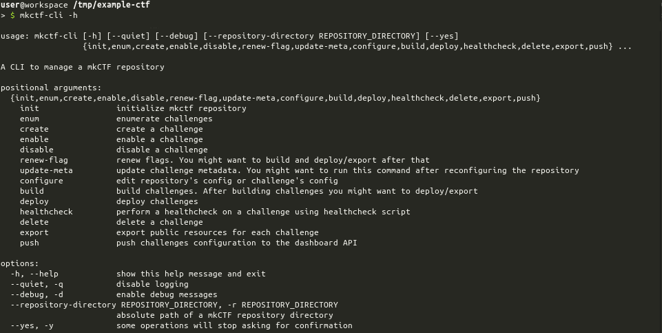
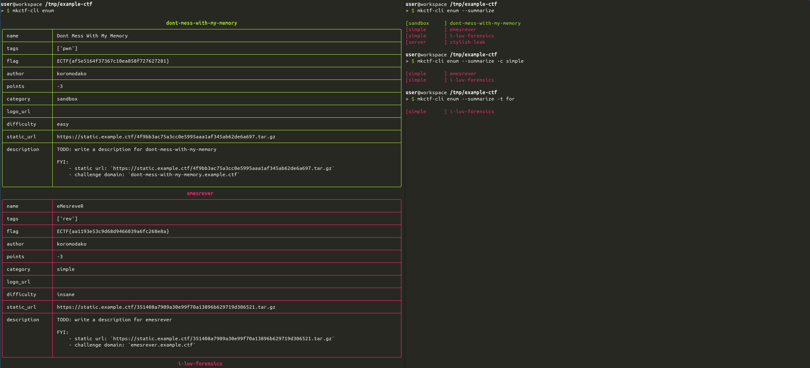

# mkCTF

## Why ?

This framework aims at helping your team create jeopardy CTF challenges
using a configurable structure which will enable efficient integration and
deployment on the CTF infrastructure.

This project was initially created for managing challenges for
[INS'hAck 2017](https://github.com/HugoDelval/inshack-2017).

You can find challenges and writeups of the past editions of INS'hAck in
[this repository](https://github.com/InsecurityAsso).

This project evolved over time to enable even more automation when deploying
challenges on a Rancher-based infrastructure.


## Caution

Your mkCTF repository **shall remain private until the CTF event ends**. It
stores flags in plaintext to allow CTF admins to rebuild challenges from
sources without generating new flags. It is recommended to enable 2FA add
defensive layers to your repository. Do not generate or manage read-only access
token lightly. Do not give access to your repository to untrusted users.


## Dependencies

This project requires Python 3.9+ and has been designed and tested on Linux
only. It might work on Darwin and Windows Subsystem for Linux as well.

Other dependencies will depend on the challenges themselves.


## Setup

You can setup mkCTF in a few steps:

```bash
curl -o setup.sh https://raw.githubusercontent.com/koromodako/mkctf/master/setup.sh
chmod +x setup.sh
./setup.sh
rm setup.sh
```

Then create your first CTF:

```bash
mkdir example-ctf && cd example-ctf
mkctf-cli init
# then simply follow the terminal prompts
```


## Tools

Each tool description may refer to concepts defined in **Concepts** section so
make sure to check it out if you encounter an new concept.


### mkctf-cli

`mkctf-cli` helps you and CTF co-authors to manipulate a mkCTF repository. It
ensures that challenges integration with the CTF infrastructure won't give you
a headache.



You can enumerate challenges to have a quick overview of the work progression
and distribution across tags and categories.



You can also export public files of your challenges in a single command. Public
files location in a challenge directory can be configured.


### mkctf-monitor

`mkctf-monitor` is an all-in-one monitoring solution running healthchecks on a
regular basis and sending reports to the dashboard using an HTTP API defined in
**Dashboard** section.


Once you have initialized your mkCTF repository, you can build a monitoring
image and run it by following this procedure:

```bash
cd example-ctf
mkdir monitoring/ctf
cp -r .mkctf challenges monitoring/ctf
sudo DOCKER_BUILDKIT=1 docker build -t example-ctf-monitoring:1.0.0 .
sudo docker container run --rm \
                          --env monitoring.env \
                          --name monitoring \
                          example-ctf-monitoring:1.0.0
```


## Concepts

### Challenge

Challenges are the base of jeopardy CTF. Each challenge can be described using
some metadata:

```yaml
# challenge author to be displayed on the dashboard
author: someone
# category in terms of infrastructure requirements
#  - `simple` means that the challenge is static (downloadable elements only)
#  - `server` means that the challenge requires a server and server can be shared
#    between all players, challenge vulnerabilities allow read-only access at most
#  - `sandbox` means that the challenge can be destroyed/altered by a player and
#    shall be allocated on a per team or player basis
category: simple
# challenge estimated difficulty to be displayed on the dashboard
difficulty: hard
# enabled is set to true when the challenge is considered production-ready:
#  - it runs
#  - it is stable
#  - it has been integrated successfully with the CTF infrastructure
#  - it has been tested successfully (at least manually)
enabled: false
# challenge flag to be found by the player and to be used when building or
# health-checking, it can be set manually or generated automatically
flag: INSA{Th1s_Is_N0t_A_R34L_flag;)}
# challenge logo to be displayed on the dashboard
logo_url: ''
# display name of the challenge
name: My New Challenge
# number of points to be awarded when the challenge is solved. `-3` is a specific
# value meaning that the number of points must be calculated dynamically for this
# challenge
points: -3
# slug of the challenge
slug: my-new-challenge
# static url of the challenge archive. It is generated automatically from repo
# `salt` and `base_url`
static_url: https://static.ctf.insecurity-insa.fr/9afb7029e93ed50c280c69c8443418c5683d05f8.tar.gz
# tags are chosen by the author to specify the nature the challenge
tags:
- forensics
```


### Repository

A repository contains a collection of challenges and monitoring resources. It
can described using some metadata:

```yaml
general:
  # difficulties holds a list of difficulties which can be used to describe a
  # challenge complexity
  difficulties:
  - very easy
  - easy
  - medium
  - hard
  - insane
  # docker holds the information related to the registry where challenge images
  # will be stored.
  docker:
    registry: registry.example.ctf
    user: examplectf
  # domain holds the parent domain of all challenges
  domain: example.ctf
  # flag holds the prefix and suffix to be used for challenges
  flag:
    prefix: ECTF{
    suffix: '}'
  # tags holds a list of tags available to categorize challenge content
  tags:
  - for
  - rev
  - pwn
  - web
  - web3
  - prog
  - osint
  - radio
  - crypto
  - mobile
  - bounty
  - stegano
# categories holds the list of files and directories to be created for each
# infrastructure category (sandbox, server, simple)
categories:
  sandbox:
    dirs:
      private:
      - server
      public: []
    files:
    - exec: false
      from: Dockerfile.sandbox-server
      name: server/Dockerfile
    - exec: false
      from: Dockerfile.server
      name: server/Dockerfile.sandbox
    - exec: false
      from: banner
      name: server/banner
    - exec: false
      from: sshd_config
      name: server/sshd_config
    - exec: true
      from: sandbox_start.sh.jinja
      name: server/sandbox_start.sh
  server:
    dirs:
      private:
      - server
      public: []
    files:
    - exec: false
      from: Dockerfile.server
      name: server/Dockerfile
  simple:
    dirs:
      private:
      - private
      public: []
    files: []
# display name of the jeopardy CTF
name: ExampleCTF
# standard holds the common files and directories to be created for each
# challenge
standard:
  build:
    exec: true
    from: build.jinja
    name: build
  deploy:
    exec: true
    from: deploy.jinja
    name: deploy
  description:
    exec: false
    from: description.md.jinja
    name: description.md
  dirs:
    private: []
    public:
    - public
  files:
  - exec: false
    from: null
    name: .gitignore
  - exec: false
    from: writeup.md.jinja
    name: writeup.md
  - exec: false
    from: healthcheck.deps
    name: healthcheck.deps
  healthcheck:
    exec: true
    from: healthcheck.jinja
    name: healthcheck
# static holds information about which domain will be used to serve each
# challenge archive (exported using `mkctf-cli export /tmp/export-example`)
# and a salt to make archive name impossible to predict
static:
  base_url: https://static.example.ctf
  salt: # hex-encoded bytes (randomly generated)
```


### Standard Programs

mkCTF framework defines some mandatory programs that have a specific purpose
in the context of integrating each challenge into the CTF infrastructure. These
programs are described below.

| Program | Purpose |
|:-------:|:--------|
| `build` | This executable builds the challenge from the sources and the configuration (flag) |
| `deploy` | This executable perform the deployment-related operations for the challenge |
| `healthcheck` | This executable performs a healcheck on the deployed challenge (checking checksum or playing an exploit) |

Previously defined programs shall respect the following specifications:

|  ID  | Specification                                                                  | Comments |
|:----:|:-------------------------------------------------------------------------------|:---------|
| `S0` | The executable **shall not take positional arguments**                         | The caller will not provide any positional argument |
| `S1` | The executable **shall be able to to handle an optional** `--dev` **argument** | This argument might be given by the caller which will expect the executable to run in `development` mode when applicable |
| `S2` | The executable **execution shall end before a timeout is triggered**           | Timeout defaults to 2 minutes. `--timeout` option enable you to override this value |
| `S3` | The executable **shall return an exit code**                                   | This code will be interpreted using the rules defined in the next table |

As explained in `S3` the program exit code will be interpreted according to
the following table:

| Exit Code | Meaning | Description |
|:---------:|:-------:|:------------|
| `0` | `SUCCESS` | The executable execution succeeded |
| `2` | `N/A` | The executable does have a meaning in the context of this challenge |
| `3` | `MANUAL` | The executable cannot perform this task entirely, you will have to get your hands dirty |
| `4` | `NOT IMPLEMENTED` | The executable is not implemented yet |
| _OTHER_ | `FAILURE` | The executable execution failed |

When using `build`, `deploy` or `healthcheck` commands, the CLI will behave as
described below.

If the **exit code** differs from `0` executable output (both _stdout_ and _stderr_)
will be printed out. You can use this behavior to print meaningful instructions
from within these programs. This behavior is particularly interesting if your
program returns a code `3` which means the user must perform a manual operation
to complete the task.

A special status `TIMEOUT` may occur when using `build`, `deploy` or `healthcheck`
commands. In that case, it means that your executable took too long to execute
as explained in specification`S2`.

### Dashboard

The dashboard is expected to provide HTTP APIs defined below. Generic endpoint
specifications are the following:

|  ID  | Specification | Details |
|:----:|:--------------|:--------|
| `R1` | The dashboard API **shall implement HTTPS with a valid certificate** | `mkctf-cli` will always use `https` scheme to post the configuration |
| `R2` | The dashboard API **endpoint shall implement basic authentication**  | `mkctf-cli` will set the Authorization header using Basic method |
| `R3` | The dashboard API **endpoint shall expect a HTTP POST query**        | `mkctf-cli` will POST challenge configuration to the dashboard |
| `R4` | The dashboard API **endpoint shall expect a application/json body**  | `mkctf-cli` will POST a JSON body to the dashboard |


#### Configuration Synchronization API

`mkctf-cli push` command allows to push every challenge configuration to the
dashboard.

```
POST /mkctf-api/push
```
```json
{
  "challenges": [
    {
      "name": "Dont Mess With My Memory",
      "slug": "dont-mess-with-my-memory",
      "tags": [
        "pwn"
      ],
      "flag": "ECTF{fake_flag_for_u_buddy}",
      "author": "koromodako",
      "points": -3,
      "enabled": true,
      "category": "sandbox",
      "logo_url": "",
      "difficulty": "easy",
      "static_url": "https://static.example.ctf/4f9bb3ac75a3cc0e5995aaa1af345ab62de6a697.tar.gz"
    }
  ]
}
```

The dashboard **shall store flags using a secure hashing mecanism** such as
[argon2](https://pypi.org/project/argon2-cffi).


#### Healthcheck Notification API

`mkctf-monitor` will push reports to the dashboard.

```
POST /mkctf-api/healthcheck
```
```json
{
    "dont-mess-with-my-memory": true,
    "stylish-leak": false,
}
```

Previous body means `dont-mess-with-my-memory` is healthy and `stylish-leak`
isn't.
